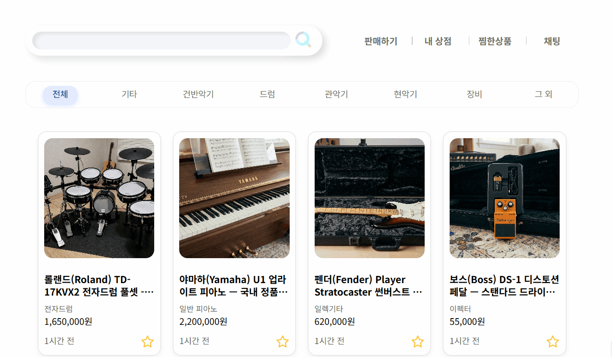
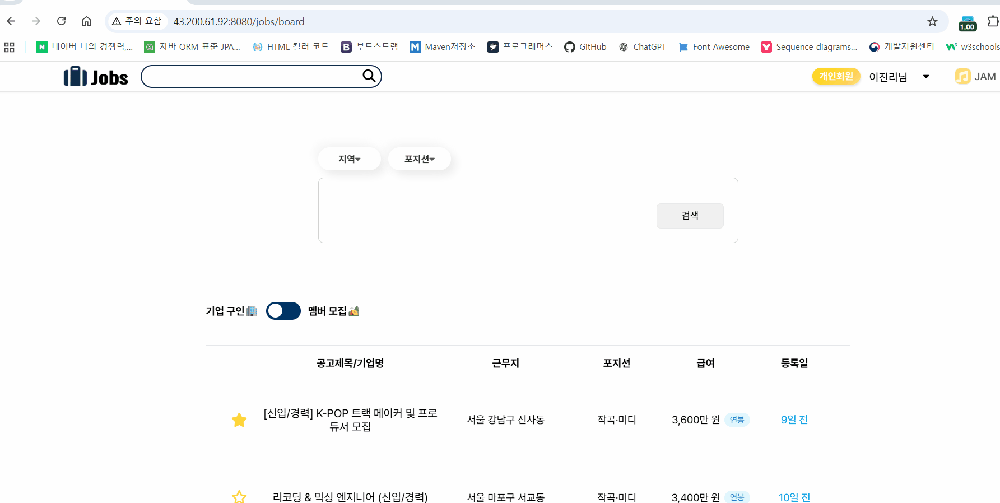
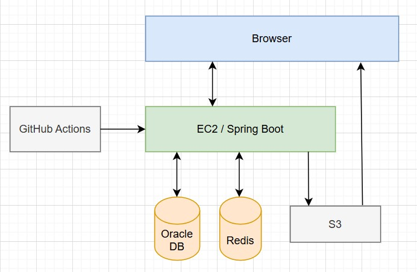
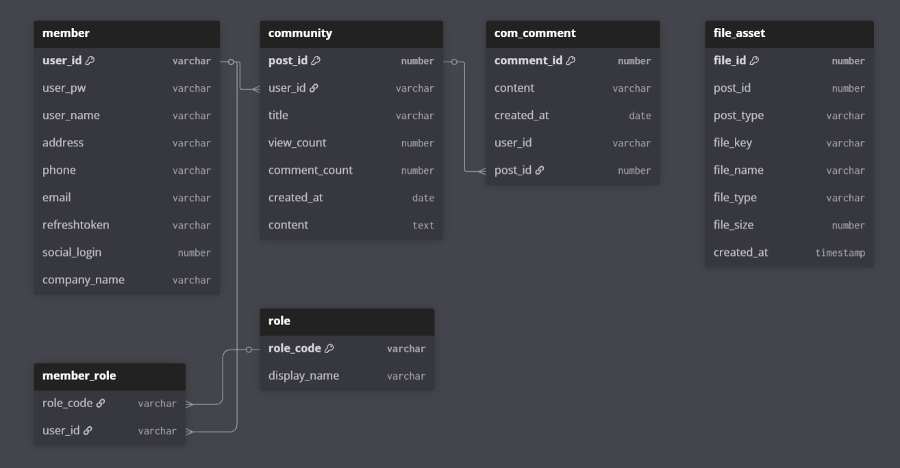
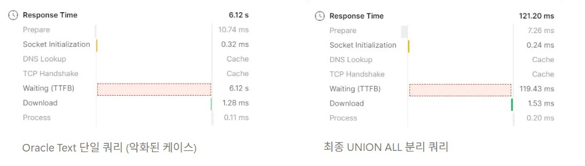

# JAM 🎵
> 음악 커뮤니티, 중고거래, 구인구직 등을 함께 이용할 수 있는 통합 음악 커뮤니티 플랫폼

<br/>

### 메인 페이지
<p align="center">
  
</p>

<br/><br/>

## 목차
- [프로젝트 개요](#-프로젝트-개요)
- [배포 주소](#배포-주소)
- [주요 기능 및 서비스 화면](#주요-기능-및-서비스-화면)
- [로컬 실행 가이드](#-로컬-실행-가이드)
- [기술 스택](#기술-스택)
- [시스템 아키텍처](#시스템-아키텍처)
- [ERD](#erd)
- [기술적 고민](#-기술적-고민)
- [프로젝트 구조](#-프로젝트-구조)
- [회고](#-회고)


<br/><br/>

## 🎯 프로젝트 개요

기존 음악 커뮤니티들은 소통, 구인구직, 중고거래 등이 여러 플랫폼에 파편화되어 있어 사용자가 매번 이동해야 하는 불편함이 있었습니다.

JAM은 이러한 불편함을 해소하고, 음악인들이 필요한 모든 활동을 한곳에서 즐길 수 있는 환경을 목표로 개발했습니다.

프로젝트 이름은 즉흥 연주라는 의미의 Jam Session에서 착안했습니다.

<br>


### 배포 주소
- 서비스 : http://43.200.61.92:8080/
- 기업 계정
  - ID : company1
  - PW : test1234
- 일반 회원 계정
  - ID : member123
  - PW : test1234

※ 두 계정을 이용하여 채팅 기능을 테스트할 수 있습니다.

<br/><br/>

## 주요 기능 및 서비스 화면

### 커뮤니티
> 음악 장비, 감상, 작업 팁 등을 자유롭게 공유하는 커뮤니티 게시판

<br>
<table width="100%">
  <tr>
    <td width="50%" align="center" valign="top">
      <b>[ 목록 페이지 ]</b><br><br>
      
    </td>
    <td width="50%" align="center" valign="top">
      <b>[ 상세 페이지 ]</b><br><br>
      
    </td>
  </tr>
</table>
<br>

**📝 게시글**
- 게시글 작성 / 조회 / 수정 / 삭제
- 작성한 게시글 다중 삭제
- 이미지 파일 업로드 지원
- 조회수 및 댓글 수 기반 인기글 노출


**💬 댓글**
- 댓글 조회 / 작성 / 수정 / 삭제


**🔍 검색**
- 제목 및 내용 통합 검색


**⭐ 북마크**
- 게시글 북마크 추가 / 삭제
- 북마크한 게시글 조회
<br>

---

<br>

### 중고 악기 거래
> 사용자가 악기를 사고팔며, 판매자와 채팅으로 직접 소통할 수 있는 중고 거래 게시판

<p align="center">
  
</p>

<br>


**🎸 상품 게시글**
- 상품 게시글 작성 / 조회 / 수정 / 삭제
- 작성한 상품 게시글 조회
- 판매 상태 변경 (판매중 / 판매완료)


**🖼️ 이미지**
- 상품 이미지 다중 업로드 지원


**🔍 검색**
- 카테고리 기반 상품 검색


**❤️ 찜 (관심 상품)**
- 상품 찜 추가 / 삭제
- 찜한 상품 조회


**💬 채팅 연동**
- 상품 게시글 기반 채팅 연결 (상품 문의 → 채팅)
<br>

---

<br>

### 구인 구직
> 음악 관련 구인 공고를 확인하거나 밴드 멤버를 모집하고, 원하는 공고에 지원할 수 있는 게시판

<p align="center">
  
</p>


<br>


**🏢 공고 관리 (기업)**
- 구인 공고 및 밴드 멤버 모집글 등록
- 공고 작성 / 조회 / 수정 / 삭제
- 작성한 공고 목록 조회
- 공고 상태 관리 (진행중 / 마감)


**👤 지원자 관리 (기업)**
- 공고 지원자 목록 조회
- 지원자의 지원서 조회 및 이력서 다운로드
- 공고별 지원 현황 조회


**🎯 공고 탐색 (사용자)**
- 지역 기반 모집 공고 조회
- 지역 및 포지션 기반 검색
- 키워드 검색 (지역/포지션 검색과 별도)


**📄 지원 기능 (사용자)**
- 공고 지원 시 이력서 파일 업로드
- 지원 내역 조회 (공고 상태 및 지원 시점 기준 필터링)
- 지원 취소


**🧾 이력서 관리**
- 작성한 지원서 조회 및 이력서 다운로드


**🔄 회원 전환**
- 일반 회원 → 기업 회원 전환


**⭐ 스크랩**
- 공고 스크랩 추가 / 삭제
- 스크랩한 공고 조회
<br>

---

<br>

### 실시간 채팅
> 사용자 간 메시지를 주고받으며 거래 관련 대화를 나눌 수 있는 실시간 채팅 기능


**💬 1:1 채팅**
- 사용자 간 실시간 1:1 채팅 (WebSocket 기반)
- 채팅방 생성 및 입장


**📩 메시지**
- 텍스트 메시지 전송 및 수신
- 채팅 메시지 실시간 동기화


**🗂️ 채팅방 관리**
- 채팅방 목록 조회
- 채팅방 별 메시지 히스토리 조회
- 마지막 메시지 미리보기 제공
- 최근 메시지 기준 채팅방 정렬
- 메시지 전송 시간 표시


**🔗 서비스 연동**
- 중고거래 게시글 기반 채팅 연결 (상품 문의 → 채팅)


<br/><br/>

## 🐳로컬 실행 가이드

### 1. 사전 요구 사항

- Docker & Docker Desktop: 설치 및 실행 상태여야 합니다.


<br>


### 2. 프로젝트 설정

**① 프로젝트 클론**

```bash
git clone https://github.com/Lee-jinri/JAM.git
cd JAM
```

**② 환경 변수 및 설정 파일 준비**
프로젝트 루트 디렉토리에서 아래 파일들의 이름을 변경하고 실제 값을 입력해주세요.

- `.env.example` → `.env` (애플리케이션 상세 설정 등)
- `src/main/resources/application-template.yml` → `application.yml`
- LOCATION_CONSUMER은 sgis 통계지리정보서비스의 서비스 ID와  보안 KEY 입니다.


<br>

### 3. 애플리케이션 실행

아래 명령어를 입력하면 Oracle DB(23c Free)와 Spring Boot 서버가 자동으로 구성됩니다.

`docker-compose up -d`

- **접속 정보**: http://localhost:8080
- **테스트 계정**:

| **권한** | **아이디** | **비밀번호** |
| --- | --- | --- |
| **기업 회원** | `company1` | `test1234` |
| **일반 회원** | `member123` | `test1234` |


<br>

### 4. 환경 정리 및 초기화

**① 서비스 중지**

`docker-compose stop`

**② 완전 삭제 및 초기화**
컨테이너뿐만 아니라 저장된 DB 데이터까지 모두 삭제하고 초기 상태로 되돌리고 싶을 때 사용합니다.

`docker-compose down -v`

> **`-v` 옵션 사용 시 로컬에 생성된 모든 DB 볼륨 데이터가 삭제됩니다.**
> 

---

### **🚨주의사항**

- 로컬 환경에서는 게시글 본문 검색 기능이 동작하지 않을 수 있습니다.
- **DB 권한 관련 에러**: 윈도우 환경에서 `oracle-data` 폴더 삭제가 거부될 경우, 터미널을 관리자 권한으로 실행하거나 Docker를 통해 해당 폴더를 삭제해야 합니다.
- **포트 충돌**: 로컬에 이미 오라클(1521)이나 톰캣(8080)이 실행 중인지 확인해주세요.


<br/><br/>


## 기술 스택

**Backend**: 
- Java 17, Spring Boot 3.x (Jakarta EE)
- Redis (캐싱, 분산 락)
- WebSocket (STOMP 없이 직접 구현)
- Spring Security + JWT (인증/인가)

**Infra & Database**: 
- AWS EC2, S3 (Presigned URL)
- GitHub Actions (CI/CD)
- Tomcat (WAR 배포)
- Oracle
- MyBatis

**Frontend**: 
- HTML, CSS, JavaScript
- jQuery
- Thymeleaf


<br>


## 시스템 아키텍처

<p align="center">
  
</p>

<br>

## ERD
### 회원/커뮤니티/파일

<p align="center">
  
</p>

<br>

### 중고 악기

<p align="center">
  
</p>


<br>

### 구인구직

<p align="center">
  
</p>

<br>

### 채팅

<p align="center">
  
</p>


<br/><br/>


## 🚀 기술적 고민
### 1️⃣ STOMP 미사용 WebSocket 세션 직접 관리

**배경:**
라이브러리 추상화 뒤에 숨겨진 메시지 흐름을 깊이 이해하고자 Raw WebSocket 선택

**해결:**
- `WebSocketHandler`를 직접 구현하여 세션 생명주기 관리
- `ConcurrentHashMap`기반 세션 저장소 설계  (멀티스레드 환경 고려)
- Double Mapping: 방 기준(chatRoomSession) +  세션 기준(sessionToChatRoom) 양방향 관리로  연결 종료 시 O(1) 탐색
- 비인가 사용자 연결/메시지 요청 검증
- 메시지 전송 전 채팅방 참여 여부 서버 재검증
- 상대방이 채팅방에 없을 때 실시간 알림 전송으로 메시지 수신 보장

**성과:**
실시간 1:1 채팅 시스템 구축 및 WebSocket 프로토콜 동작 원리 깊이 이해

- O(1) 기반 세션 정리 구조로 연결 종료 처리 성능 개선
- 채팅방 참여 검증 로직으로 비인가 메시지 차단
- 실시간 1:1 채팅 안정적 처리 구조 구축

👉 [관련 소스코드 보기](src/main/java/com/jam/chat/webSocket/WebSocketHandler.java)


<br><br>


### 2️⃣ Redisson 분산 락을 활용한 동시성 제어

**배경:**
1:1 채팅방 생성 시 동시 요청으로 인한 데이터 중복 생성(Race Condition) 리스크 인지

**해결** :

- Redis 기반의 `Redisson` 분산 락을 도입하여 다중 서버 환경에서도 유일한 채팅방 생성을 보장하는 로직 설계
- pairKey 정규화로 동일 사용자 쌍 직렬화
- Double-Checked Locking으로 불필요한 DB 접근 최소화
- finally에서 isHeldByCurrentThread() 체크로 안전한 락 해제
- DB 유니크 제약 + DuplicateKeyException fallback으로 다층 방어

**성과:** 
단일 서버 환경에서 150ms 간격 동시 요청에 대한 중복 생성 방지 검증 완료

**트레이드 오프**:

- 락 획득 대기 시간으로 인해 응답 지연 가능성 존재
- Redis 장애 시 채팅방 생성 로직 영향 (인프라 의존성 증가)


👉 관련 소스코드 보기
<br>
- [ChatRoomFacade.java: 분산 락 획득/해제 및 락 최적화 로직 (Facade Pattern)](src/main/java/com/jam/chat/service/ChatRoomFacade.java)
- [ChatService.java: 트랜잭션 처리 및 DuplicateKeyException 예외 2차 방어 로직](src/main/java/com/jam/chat/service/ChatService.java)


<br/>
<br/>

**[검증] 서버 로그 (**중복 클릭 상황에서 채팅방 생성 검증**)**

사용자가 채팅 시작 버튼을 빠르게 두 번 클릭하는 상황을 가정하여
동일한 채팅방 생성 요청이 연속으로 발생할 때 중복 채팅방이 생성되지 않는지 확인했습니다.

<p align="center">
  
</p>

<br>

서버 로그

```jsx
[첫 번째 요청 - 채팅방 생성]

14:56:42.081  ChatRestController.getChatRoomId(..) START
14:56:42.120  ChatService.createChatRoomWithTransaction(..) START
14:56:42.132  새로운 채팅방 생성 완료: 23
14:56:42.132  ChatService.createChatRoomWithTransaction(..) END return=23
14:56:42.154  ChatRestController.getChatRoomId(..) END return=23

[두 번째 요청 - 중복 생성 방지]

14:56:42.234  ChatRestController.getChatRoomId(..) START
14:56:42.242  ChatService.createChatRoomWithTransaction(..) START
14:56:42.244  ChatService.createChatRoomWithTransaction(..) END return=23
14:56:42.248  ChatRestController.getChatRoomId(..) END return=23
```

<br>

[결과]

- 첫 번째 요청 → 채팅방 생성 (room_id = 23)
- 두 번째 요청 → 기존 채팅방 재사용 (room_id = 23)

두 개의 요청이 150ms 간격으로 연속 발생했지만
채팅방은 한 번만 생성되고 동일한 roomId가 반환되었습니다.

<br><br>

### **3️⃣SSR 환경에서 CSR 직접 도입**

**배경:**
SSR만 경험한 상태에서 REST API와 CSR 구조를 직접 이해하고자 SSR 프로젝트에 CSR 방식을 도입

**문제 1:** CSR 도입 후 페이지 이동 시마다 JWT 검증이 반복되며 응답 지연 발생

**해결 1:** 

- JWT 파싱이 필요한 URI만 선별하여 불필요한 인증 제거
- Spring Security 필터 체인 커스텀을 통해 중복 검증 로직 최적화


<br>


**문제 2:** JWT 도입에도 세션을 병행하여 Stateless 이점 부재

**해결 2:** 

- **1차 시도:** 
SPA 방식처럼 사용자 정보 API 별도 호출 
→ 매 페이지마다 API 과다 호출 문제 재발
- **최종 해결:** 
SSR 구조를 활용하여, Thymeleaf 렌더링 시점에 SecurityContext를 1회 주입하는 하이브리드 방식 설계
→ 세션 제거 + CSRF 토큰 적용으로 Stateless 아키텍처 완성

**성과:** 

- SSR의 초기 렌더링 이점과 CSR의 비동기 통신을 결합한 혼합 구조 설계
- Stateless JWT 완성
- 향후 React 전환 시 API 재사용 가능한 구조 확보

**트레이드오프:**

- 현재 구조는 SSR에 종속적이며, 완전한 SPA 전환 시 사용자 정보 조회를 위한 별도 API 필요
- Thymeleaf 렌더링 시 서버 요청이 발생하는 구조적 한계 존재
- 순수 SPA 대비 초기 렌더링 흐름이 복잡

> 💡결론:  SSR 환경에 CSR을 억지로 끼워 맞추는 것은 인증/상태 관리 복잡도를 높이며 구조적 이점이 제한적임을 실무적으로 체감함

<br><br>

### **4️⃣** S3 Presigned URL 기반 클라이언트 직접 업로드

**배경:** 
서버 메모리를 거치는 기존 업로드 방식의 서버 사이드 오버헤드와 I/O 병목 및 확장성 문제 고려

**해결:**

- 서버는 Presigned URL만 발급하고 실제 파일은 클라이언트가 S3로 직접 업로드하는 구조 설계
- 업로드 전 서버에서 파일 타입/크기 사전 검증
- Promise.all로 다중 파일 병렬 업로드 처리
- 다운로드 시 인가된 사용자만 URL 발급 (URL 탈취 시에도 무단 접근 방지)

**성과:** 

- 서버 Heap 점유 없이 파일 업로드 처리
- URL 기반 접근 제어로 무단 다운로드 방지

<br><br>

### 5️⃣ 커뮤니티 검색 성능 최적화 (1.26s → 121ms, 약 10배 개선)

**배경:**
제목(VARCHAR)과 본문(CLOB) 통합 검색 시, 대량 데이터 환경에서 Full Table Scan 발생으로 응답 속도 저하(1.26s)

**해결 및 트러블슈팅:**

1. **1차 시도:** 제목에 B-Tree 인덱스 적용했으나 본문 검색 조건(LIKE %keyword%)으로 인해 제한적 개선(1.04s)
2. **2차 시도:** 본문(CLOB) 검색을 위해 **Oracle Text(CONTEXT Index)** 도입
→ 단일 쿼리에서 `OR` 조건으로 결합 시, 옵티마이저가 인덱스를 효율적으로 선택하지 못해 오히려 6.12s로 급격한 성능 악화
3. **최종 해결:** 제목 검색(B-Tree)과 본문 검색(Oracle Text)을 별도 쿼리로 분리 후 `UNION ALL`로 결합. 
→  각 조건이 최적의 인덱스를 활용하도록 쿼리 튜닝

**성과:**

- 응답 시간 1.26s → 121ms (약 10배 개선)
- 10만 건 기준 DB 쿼리 실행 시간 80ms
- 1페이지 41ms / 10000페이지 145ms

**트레이드오프 :**

- Oracle Text 인덱스 동기화 주기로 인한 실시간 반영 지연 가능성 존재
- `UNION ALL` 구조로 쿼리 유지보수 복잡도와 정렬 로직 최적화(Sort Merge) 고려


| 단계 | 최적화 방식 | 응답 시간 | 결과 |
| :--- | :--- | :---: | :---: |
| 초기 | 인덱스 미적용 | 1,260ms | - |
| 1차 | 제목 B-Tree 인덱스 | 1,040ms | 효과 미미 |
| 2차 | Oracle Text 단일 쿼리 | 6,120ms | 성능 악화 |
| **최종** | **UNION ALL 분리 쿼리** | **121ms** | **90.4% 개선** |

<br>

<p align="center">
  
</p>

<br><br>


## 📂 프로젝트 구조

```text
src/main
 ├── java/com/jam
 │    ├── community
 │    │    └── controller
 │    │        ├── CommunityController.java      <-- View Controller (페이지 반환)
 │    │        └── CommunityRestController.java  <-- REST API Controller (데이터 처리)
 │    ├── chat
 │    │    ├── webSocket                          <-- WebSocket 직접 구현체
 │    │    └── service
 │    │        ├── ChatService.java               <-- 채팅 비즈니스 로직
 │    │        └── ChatRoomFacade.java            <-- 분산 락 처리
 │    ├── member                                  <-- 사용자 관리
 │    ├── config                                  <-- 보안 및 설정
 │    └── global                                  <-- 공통 처리 (예외 등)
 └── resources
      ├── mapper                                  <-- MyBatis Mapper (SQL 매핑) 
      └── templates                               <-- Thymeleaf 기반 View
``` 


- 도메인 중심 패키지 구조
- View Controller / REST Controller 분리
- ChatService / ChatRoomFacade 분리 (비즈니스 로직 · 분산 락 분리)
- config · global 패키지로 공통 기능 관리


<br>

## 💭 회고

- 초기 설계 미흡으로 기능 추가마다 구조를 개선해야 했고, 이 과정에서  설계의 중요성을 직접 체감했습니다.
- 단순히 기술을 적용하는 것보다 "왜 이 기술이 필요한가" 에 대한 근거를 찾는 과정의 중요성을 깨달았습니다.
- JPA와 React를 도입해 고도화하려 시도했으나 기존 구조와의 호환성 문제 및 트랜잭션 관리 등의 기술적 난관을 겪었습니다. 한정된 일정 내에 프로젝트 완성도를 높이기 위해 도입하지 못했지만 다음 프로젝트에서는 한층 더 견고한 애플리케이션을 구축하고자 합니다.
