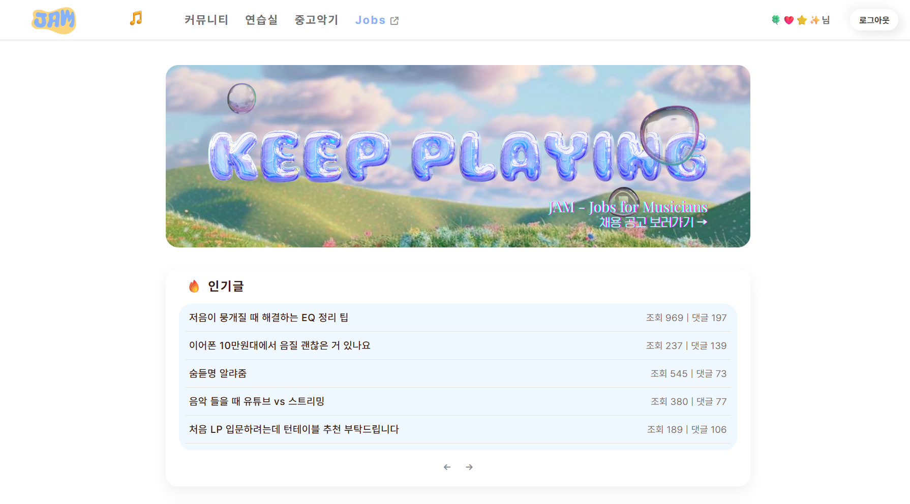
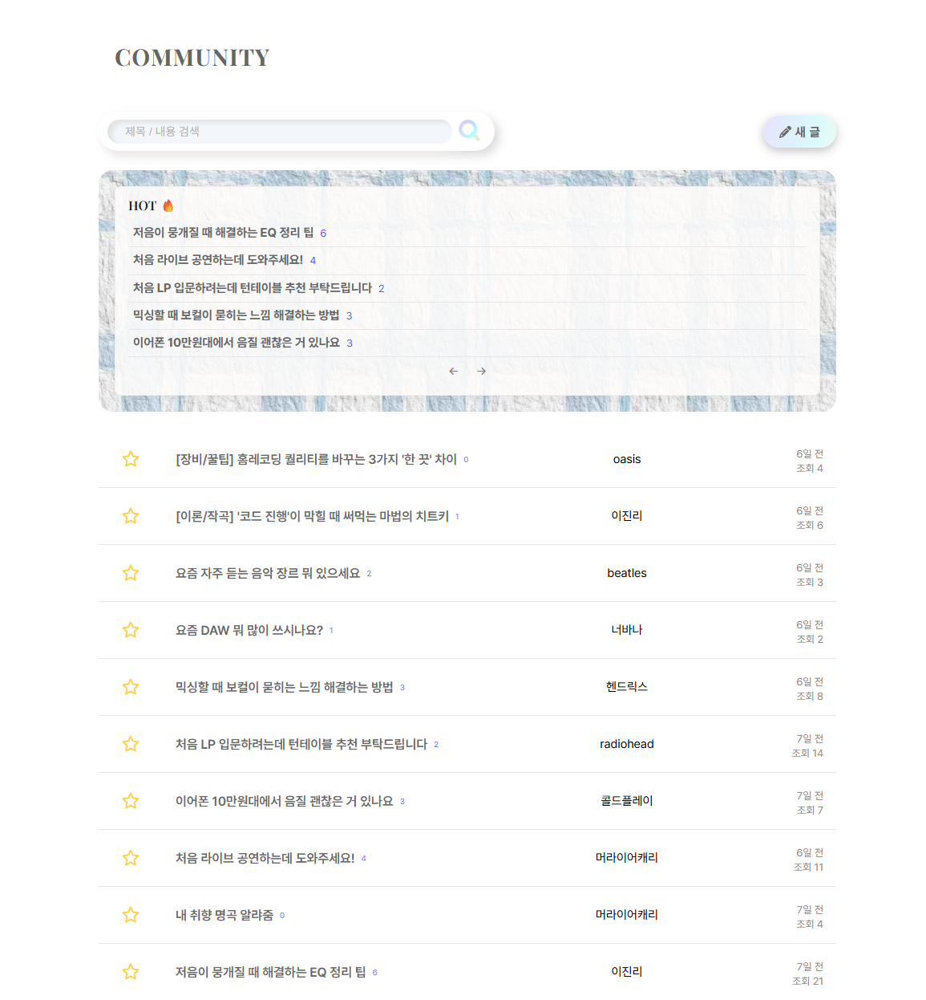
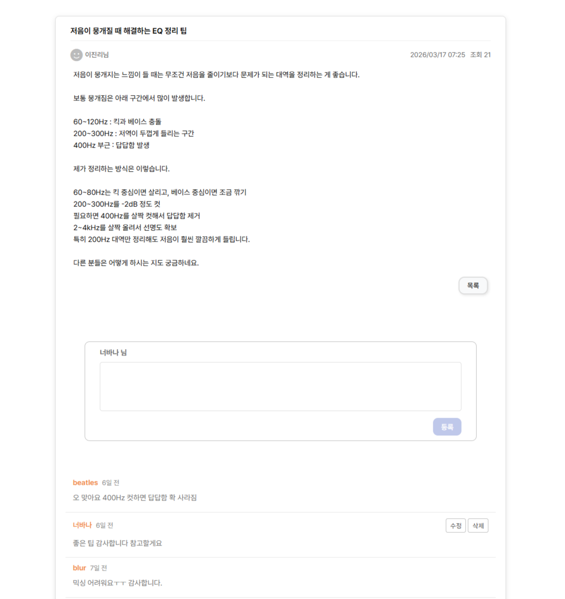
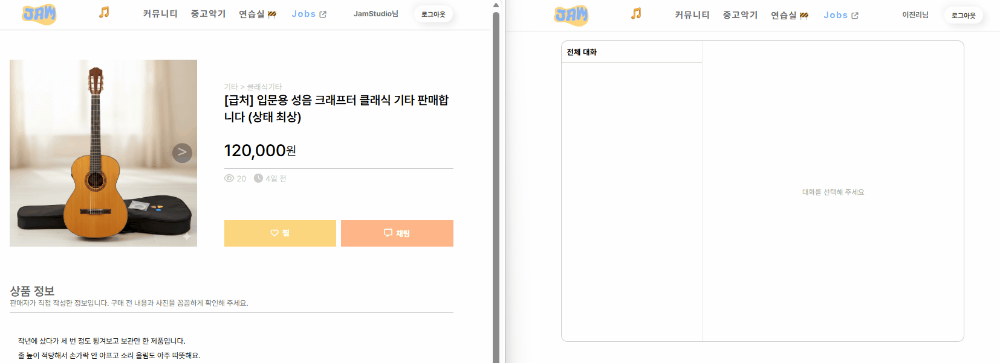

# JAM 🎵
> 음악 커뮤니티, 중고거래, 구인구직 등을 함께 이용할 수 있는 통합 음악 커뮤니티 플랫폼 
 

## 메인 페이지

 

## 배포 주소
- 서비스 : http://43.200.61.92:8080/
- 기업 계정
  - ID : company1
  - PW : test1234
- 일반 회원 계정
  - ID : member123
  - PW : test1234

※ 두 계정을 이용하여 채팅 기능을 테스트할 수 있습니다.
  

## 주요 기능

### 커뮤니티
> 음악 장비, 감상, 작업 팁 등을 자유롭게 공유하는 커뮤니티 게시판

 
<table width="100%">
  <tr>
    <td width="50%" align="center" valign="top">
      <b>[ 목록 페이지 ]</b>  
      
    </td>
    <td width="50%" align="center" valign="top">
      <b>[ 상세 페이지 ]</b>  
      
    </td>
  </tr>
</table>
 

**📝 게시글**
- 게시글 작성 / 조회 / 수정 / 삭제
- 작성한 게시글 다중 삭제
- 이미지 파일 업로드 지원
- 조회수 및 댓글 수 기반 인기글 노출

**💬 댓글**
- 댓글 조회 / 작성 / 수정 / 삭제

**🔍 검색**
- 제목 및 내용 통합 검색

**⭐ 북마크**
- 게시글 북마크 추가 / 삭제
- 북마크한 게시글 조회
 

---

 

### 중고 악기 거래
> 사용자가 악기를 사고팔며, 판매자와 채팅으로 직접 소통할 수 있는 중고 거래 게시판

**🎸 상품 게시글**
- 상품 게시글 작성 / 조회 / 수정 / 삭제
- 작성한 상품 게시글 조회
- 판매 상태 변경 (판매중 / 판매완료)

**🖼️ 이미지**
- 상품 이미지 다중 업로드 지원

**🔍 검색**
- 카테고리 기반 상품 검색

**❤️ 찜 (관심 상품)**
- 상품 찜 추가 / 삭제
- 찜한 상품 조회

**💬 채팅 연동**
- 상품 게시글 기반 채팅 연결 (상품 문의 → 채팅)
 

---

 

### 구인 구직
> 음악 관련 구인 공고를 확인하거나 밴드 멤버를 모집하고, 원하는 공고에 지원할 수 있는 게시판

**🏢 공고 관리 (기업)**
- 구인 공고 및 밴드 멤버 모집글 등록
- 공고 작성 / 조회 / 수정 / 삭제
- 작성한 공고 목록 조회
- 공고 상태 관리 (진행중 / 마감)

**👤 지원자 관리 (기업)**
- 공고 지원자 목록 조회
- 지원자의 지원서 조회 및 이력서 다운로드
- 공고별 지원 현황 조회

**🎯 공고 탐색 (사용자)**
- 지역 기반 모집 공고 조회
- 지역 및 포지션 기반 검색
- 키워드 검색 (지역/포지션 검색과 별도)

**📄 지원 기능 (사용자)**
- 공고 지원 시 이력서 파일 업로드
- 지원 내역 조회 (공고 상태 및 지원 시점 기준 필터링)
- 지원 취소

**🧾 이력서 관리**
- 작성한 지원서 조회 및 이력서 다운로드

**🔄 회원 전환**
- 일반 회원 → 기업 회원 전환

**⭐ 스크랩**
- 공고 스크랩 추가 / 삭제
- 스크랩한 공고 조회
 

---

 

### 실시간 채팅
> 사용자 간 메시지를 주고받으며 거래 관련 대화를 나눌 수 있는 실시간 채팅 기능

**💬 1:1 채팅**
- 사용자 간 실시간 1:1 채팅 (WebSocket 기반)
- 채팅방 생성 및 입장

**📩 메시지**
- 텍스트 메시지 전송 및 수신
- 채팅 메시지 실시간 동기화

**🗂️ 채팅방 관리**
- 채팅방 목록 조회
- 채팅방 별 메시지 히스토리 조회
- 마지막 메시지 미리보기 제공
- 최근 메시지 기준 채팅방 정렬
- 메시지 전송 시간 표시

**🔗 서비스 연동**
- 중고거래 게시글 기반 채팅 연결 (상품 문의 → 채팅)
 

## 기술 스택

**Backend**: 
- Java 17, Spring Boot 3.x (Jakarta EE)
- Redis (캐싱, 분산 락)
- WebSocket (STOMP 없이 직접 구현)
- Spring Security + JWT (인증/인가)

**Infra & Database**: 
- AWS EC2, S3 (Presigned URL)
- GitHub Actions (CI/CD)
- Tomcat (WAR 배포)
- Oracle
- MyBatis

**Frontend**: 
- HTML, CSS, JavaScript
- jQuery
- Thymeleaf

## 시스템 아키텍처

## 핵심 구현

